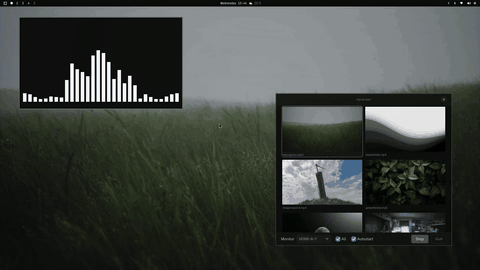

# MotionVpaper 🎬



A clean, minimal GTK4/libadwaita GUI for managing [mpvpaper](https://github.com/GhostNaN/mpvpaper) video wallpapers on [Hyprland](https://hyprland.org/).

## Features

- **Video library** — add/remove videos, thumbnails auto-generated via ffmpeg
- **Multi-monitor** — play on a specific monitor or all monitors at once
- **Auto-restart watchdog** — automatically recovers from mpvpaper crashes
- **Auto-play resume** — resumes last wallpaper on app startup
- **Autostart** — optional desktop autostart entry
- **State persistence** — remembers last video, monitor, and play state

## Requirements

- [Hyprland](https://hyprland.org/) (Wayland compositor)
- [mpvpaper](https://github.com/GhostNaN/mpvpaper) (video wallpaper backend)
- Python 3.10+
- GTK4 + libadwaita (PyGObject)
- ffmpeg (for thumbnails)
- `hyprctl` (bundled with Hyprland)

### Arch Linux

```bash
sudo pacman -S python-gobject gtk4 libadwaita ffmpeg
yay -S mpvpaper
```

## Install

```bash
git clone https://github.com/xquos/motionvpaper.git
cd motionvpaper
```

### Desktop entry (optional)

```bash
mkdir -p ~/.local/share/applications
cp motionvpaper.desktop ~/.local/share/applications/
# Edit the Exec path in the .desktop file to match your install location
update-desktop-database ~/.local/share/applications/
```

### Autostart (optional)

```bash
mkdir -p ~/.config/autostart
cp motionvpaper.desktop ~/.config/autostart/
```

## Usage

**Launch:**
```bash
python3 main.py
```
Or search for "MotionVpaper" in your app launcher.

**Workflow:**
1. Click **Add Video** or the `+` card to add video files
2. Select a video from the grid
3. Choose a monitor (or toggle "All")
4. Click **Play** to start the wallpaper
5. Click **Stop** to stop, or just close the app

## Configuration

| Path | Purpose |
|------|---------|
| `~/.config/motionvpaper/library.json` | Video library |
| `~/.config/motionvpaper/state.json` | Last video, monitor, play state |
| `~/.cache/motionvpaper/thumbs/` | Generated thumbnails |

## How It Works

MotionVpaper is a frontend for [mpvpaper](https://github.com/GhostNaN/mpvpaper) — it doesn't play videos itself. When you click Play, it spawns:

```
mpvpaper -f -o "loop-file=yes" <monitor> <video_path>
```

The built-in watchdog checks every 5 seconds if mpvpaper is still running. If it crashes (a known issue in mpvpaper 1.8 with segfaults on loop), MotionVpaper automatically restarts it with the same video and monitors.

## License

MIT